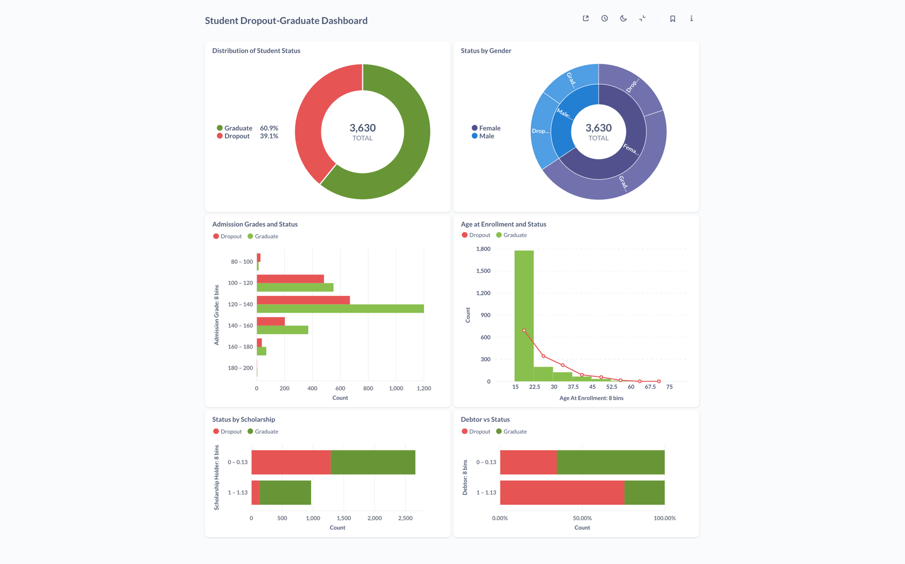
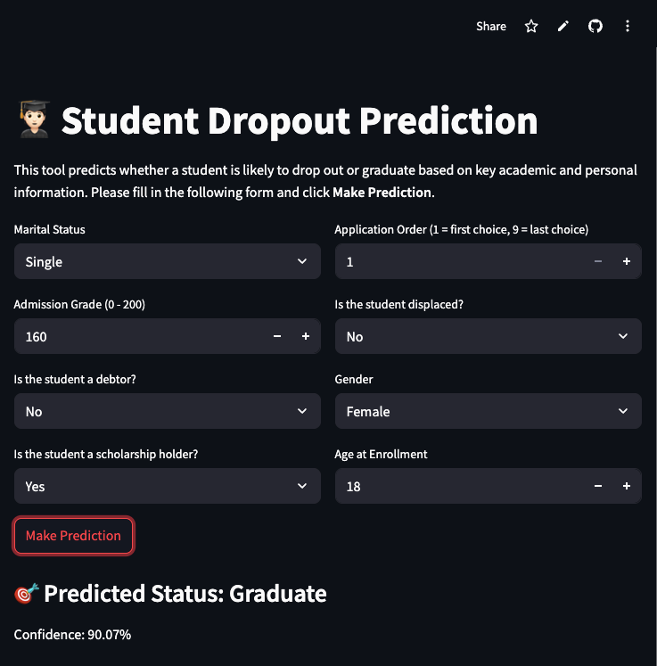

# Final Project: Solving the Edutech Company's Problem

---

## **Business Understanding**

### **Background**

Jaya Jaya Institut is a well-established higher education institution that has been operating since the year 2000.
Over the years, it has earned an excellent reputation for producing quality graduates. 
However, the institution faces a critical challenge **a high student dropout rate**. 
Many students do not complete their studies, which poses both academic and financial consequences for the institution.

To address this issue, Jaya Jaya Institut aims to use **Machine Learning** and **Business Intelligence** tools to **identify students at risk of dropping out**. By leveraging predictive analytics, the institution intends to take **early intervention actions** to provide tailored support and guidance to at-risk students.

### **Business Problems**

1. **High Dropout Rates**
   Despite the institution’s strong reputation, many students drop out after the first or second semester, leading to a loss of potential graduates. This impacts both the academic environment and financial stability.

2. **Lack of Early Detection for At-Risk Students**
   Currently, there is no system in place to detect students at risk of dropout early enough. This leads to missed opportunities for intervention before the situation worsens.

3. **Limited Insights into Student Performance**
   The institution struggles to have a clear, data-driven overview of student progress and engagement, making it hard to identify patterns or potential problems before it’s too late.

### **Project Scope**

The scope of this project includes:
* **Data Collection**: Gathering internal data from Jaya Jaya Institut. This includes information about student demographics, academic performance, and socio-economic factors.
* **Data Understanding and Exploration**: Analyzing the dataset to understand the features and their relationships with student dropout rates.
* **Model Development**: Building a **Machine Learning model** to predict whether a student is at risk of dropping out based on the collected data. This will help the institution intervene in a timely manner.
* **Business Dashboard**: Developing a **Metabase dashboard** that provides insights into dropout trends, allows monitoring of student performance, and highlights potential at-risk students.
* **Prototyping**: Creating a **Streamlit prototype** that allows the institution to input student data and get immediate predictions about the likelihood of dropout.

---

### **Preparation**

#### **Data Sources**
The dataset used for this project is internal data from **Jaya Jaya Institut** provided by **Dicoding**. 
It contains detailed records of students, their demographics, academic performance, and socio-economic factors. 

The dataset is available for download via a public GitHub repository. The raw dataset can be found here: [Students' Performance Dataset](https://github.com/dicodingacademy/dicoding_dataset/blob/main/students_performance/data.csv).

#### **Data Dictionary**
Here’s an overview of the features included in the dataset:

| **Column Name**                            | **Description**                                                                                                                                                                                           |
| ------------------------------------------ | --------------------------------------------------------------------------------------------------------------------------------------------------------------------------------------------------------- |
| **Marital status**                         | The marital status of the student. (Categorical: 1 – Single, 2 – Married, 3 – Widower, 4 – Divorced, 5 – Facto union, 6 – Legally separated)                                                              |
| **Application mode**                       | The method of application used by the student. (Categorical: Multiple application types)                                                                                                                  |
| **Application order**                      | The order in which the student applied. (Numerical: 0 – first choice; 9 – last choice)                                                                                                                    |
| **Course**                                 | The course taken by the student. (Categorical: Course IDs and names)                                                                                                                                      |
| **Daytime/evening attendance**             | Whether the student attends classes during the day or in the evening. (Categorical: 1 – Daytime, 0 – Evening)                                                                                             |
| **Previous qualification**                 | The qualification obtained by the student before enrolling in higher education. (Categorical: Various levels of qualifications such as Secondary Education, Bachelor's Degree, Master's, Doctorate, etc.) |
| **Previous qualification grade**           | Grade of previous qualification (between 0 and 200).                                                                                                                                                      |
| **Nacionality**                            | The nationality of the student. (Categorical: Multiple nationalities such as Portuguese, Spanish, Brazilian, etc.)                                                                                        |
| **Mother's qualification**                 | The qualification of the student's mother. (Categorical: Various education levels such as Secondary Education, Bachelor's Degree, Master's, Doctorate, etc.)                                              |
| **Father's qualification**                 | The qualification of the student's father. (Categorical: Various education levels similar to mother’s qualification)                                                                                      |
| **Mother's occupation**                    | The occupation of the student's mother. (Categorical: Various occupations such as Professionals, Technicians, Administrative Staff, etc.)                                                                 |
| **Father's occupation**                    | The occupation of the student's father. (Categorical: Various occupations similar to mother’s occupation)                                                                                                 |
| **Admission grade**                        | Admission grade (between 0 and 200).                                                                                                                                                                      |
| **Displaced**                              | Whether the student is a displaced person. (Categorical: 1 – Yes, 0 – No)                                                                                                                                 |
| **Educational special needs**              | Whether the student has any special educational needs. (Categorical: 1 – Yes, 0 – No)                                                                                                                     |
| **Debtor**                                 | Whether the student is a debtor. (Categorical: 1 – Yes, 0 – No)                                                                                                                                           |
| **Tuition fees up to date**                | Whether the student's tuition fees are up to date. (Categorical: 1 – Yes, 0 – No)                                                                                                                         |
| **Gender**                                 | The gender of the student. (Categorical: 1 – Male, 0 – Female)                                                                                                                                            |
| **Scholarship holder**                     | Whether the student is a scholarship holder. (Categorical: 1 – Yes, 0 – No)                                                                                                                               |
| **Age at enrollment**                      | The age of the student at the time of enrollment. (Numerical)                                                                                                                                             |
| **International**                          | Whether the student is an international student. (Categorical: 1 – Yes, 0 – No)                                                                                                                           |
| **Curricular units 1st sem (credited)**    | The number of curricular units credited by the student in the first semester. (Numerical)                                                                                                                 |
| **Curricular units 1st sem (enrolled)**    | The number of curricular units enrolled by the student in the first semester. (Numerical)                                                                                                                 |
| **Curricular units 1st sem (evaluations)** | The number of curricular units evaluated by the student in the first semester. (Numerical)                                                                                                                |
| **Curricular units 1st sem (approved)**    | The number of curricular units approved by the student in the first semester. (Numerical)                                                                                                                 |

#### **Environment Setup**
```bash
pip install pandas numpy matplotlib seaborn scikit-learn imbalanced-learn streamlit sqlalchemy python-dotenv psycopg2-binary
````
This command installs:
- pandas and numpy: For data manipulation and numerical computations. 
- matplotlib and seaborn: For data visualization. 
- scikit-learn: For machine learning models and evaluation. 
- imbalanced-learn: For dealing with class imbalance using techniques like SMOTE. 
- streamlit: For building the prototype web application. 
- sqlalchemy: For database connection and exporting data. 
- python-dotenv: For loading environment variables. 
- psycopg2-binary: For PostgreSQL database connection.
---


### **Business Dashboard**

The Business Dashboard was created using **Metabase** for data visualization and **PostgreSQL** as the database.
The dashboard is designed to help Jaya Jaya Institut identifying actionable insights into student success 
through 6 key visualizations.

#### **Key Visualizations:**

1. **Distribution of Student Status (Dropout vs Graduate)**  
   This chart shows the distribution of students' outcomes:
   - **Dropout**: 1,421 students (39.1%) dropped out.
   - **Graduate**: 2,209 students (60.9%) graduated.   
   The **dropout rate** is significant, highlighting the need for early intervention to improve retention.

2. **Status by Gender**  
   This visualization shows the distribution of **Dropout** and **Graduate** students by **gender**:
   * **Female**:
     * **Dropout**: 720 students
     * **Graduate**: 1,661 students
   * **Male**:

     * **Dropout**: 701 students
     * **Graduate**: 548 students   
     
   The chart indicates that **female students** have a higher **graduation rate** compared to male students, while **male students** have a slightly higher **dropout rate**.

3. **Admission Grades and Status**  
    This visualization illustrates the relationship between **admission grades** and **student status** (dropout or graduate). The data is grouped into bins based on admission grades, and the dropout and graduate statuses are visualized in contrasting colors.

   * **80 – 100**:

     * Dropout: 27 students
     * Graduate: 14 students
       The number of dropouts is higher in this range, indicating that students with lower admission grades are more likely to drop out.

   * **100 – 120**:

     * Dropout: 483 students
     * Graduate: 551 students
       Dropout rates increase with this range, but graduates are still a majority.

   * **120 – 140**:

     * Dropout: 669 students
     * Graduate: 1,200 students
       This range shows a substantial difference, with more students graduating than dropping out.

   * **140 – 160**:

     * Dropout: 202 students
     * Graduate: 370 students
       The dropout rate decreases here, as the majority of students graduate.

   * **160 – 180**:

     * Dropout: 37 students
     * Graduate: 69 students
       At this higher range, dropout rates are minimal compared to the number of graduates.

   * **180 – 200**:

     * Dropout: 3 students
     * Graduate: 5 students
       This range shows very few students at risk of dropping out, with graduation rates nearing 100%.

    **Key Insights:**
    * **Lower admission grades** (80-120) correlate with higher **dropout rates**, suggesting that students with lower initial grades may struggle more academically.
     * As **admission grades increase**, the dropout rates significantly decrease, highlighting the importance of initial academic performance in predicting student success.

4. **Age at Enrollment and Status**
    This visualization shows the relationship between **age at enrollment** and **student status** (dropout or graduate). 
   The data is grouped into age, and the dropout and graduate statuses are visualized accordingly.

   * **15 – 22.5 years**:

     * Dropout: 693 students
     * Graduate: 1,776 students
       This age group has a very high graduation rate, with many students graduating and relatively few dropping out.

   * **22.5 – 30 years**:

     * Dropout: 343 students
     * Graduate: 197 students
       The dropout rate begins to increase as students get older, with more students dropping out compared to graduates.

   * **30 – 37.5 years**:

     * Dropout: 221 students
     * Graduate: 124 students
       This group sees a further increase in dropout rates, although the overall number of students is smaller.

   * **37.5 – 45 years**:

     * Dropout: 89 students
     * Graduate: 66 students
       The dropout rate continues to rise as students age, though the numbers are still relatively low.

   * **45 – 52.5 years**:

     * Dropout: 58 students
     * Graduate: 33 students
       The trend shows that older students tend to have a higher dropout rate.

   * **52.5 – 60 years**:

     * Dropout: 15 students
     * Graduate: 10 students
       In this age range, the dropout rate starts to stabilize but remains high in comparison to the number of graduates.

   * **60 – 67.5 years**:

     * Dropout: 1 student
     * Graduate: 3 students
       Very few students in this age group, with a minimal number of dropouts.

   * **67.5 – 75 years**:

     * Dropout: 1 student
       A very small number of students, showing that age is not a strong factor for students above 67.

    **Key Insights:**
   * **Younger students** (15-22.5) tend to have a much higher **graduation rate**, with very few dropping out.
   * As **students age**, the **dropout rate increases**, particularly in the 22.5-30 age range, and continues to rise with age.
   * **Older students** (above 30 years old) have higher dropout rates.
    
5. **Status by Scholarship**
   This chart compares student outcomes based on whether they received a scholarship.

   * **Did not receive scholarship (0)**:

     * **Dropout**: 1,287 students
     * **Graduate**: 1,374 students

   * **Received scholarship (1)**:

     * **Dropout**: 134 students
     * **Graduate**: 835 students

   **Key Insights**:
   * Students **without scholarships** have nearly equal numbers of graduates and dropouts.
   * Students **with scholarships** are **much more likely to graduate**, indicating that **financial support may positively influence retention and academic success**.

6. **Status vs Debtor Status**
   This chart displays student outcomes based on their **debt status** at the time of enrollment.

   * **No debt (0)**:

     * **Dropout**: 1,109 students
     * **Graduate**: 2,108 students
       Most students without debt successfully graduated.

   * **Has debt (1)**:

     * **Dropout**: 312 students
     * **Graduate**: 101 students
       A significant majority of students with debt ended up dropping out.

    **Key Insights**:
   * **Debtor students** are far more likely to drop out, indicating that **financial hardship is a strong risk factor**.
   * In contrast, students **without debt** are much more likely to graduate.


---

### **How to Load the Dashboard via Docker**

#### **Step-by-Step Instructions to Run Metabase using Docker**

To load Metabase and connect it to  `metabase.db.mv.db` file, follow these steps:

1. **Pull the Latest Metabase Docker Image**

   Open your terminal and run the following command to pull the latest Metabase Docker image from Docker Hub:

   ```bash
   docker pull metabase/metabase:latest
   ```

2. **Create and Run the Metabase Container**

   Now, create and start a new Metabase container, mounting to `metabase.db.mv.db` file to the container. Use the following command:

   ```bash
   docker run -d -p 3000:3000 \
     -v /path/to/metabase.db.mv.db:/metabase.db/metabase.db.mv.db \
     --name metabase-jaya-jaya-institut \
     metabase/metabase:latest
   ```

   Replace `/path/to/metabase.db.mv.db` with the actual path to your `metabase.db.mv.db` file.

3. **Login to Metabase**

   Once Metabase is running, open your browser and go to:

   ```
   http://localhost:3000
   ```

   The first time you access Metabase, you’ll be prompted to enter the login credentials. Use the following credentials:

   * **Email**: `johndhoe123@mail.com`
   * **Password**: `metabase-root123-john`

4. **Access the Dashboard**

   After logging in, you will have access to the dashboard you created. You can navigate to the dashboard and interact with the visualizations.

---

## **Running the Machine Learning System**

This section explains how the dropout prediction model was developed, evaluated, and deployed as a prototype for Jaya Jaya Institut.

### **Model Overview**

A **Random Forest Classifier** was chosen due to its robustness in preventing overfitting.
It was trained to predict whether a student would **drop out** or **graduate** based on selected features.

**Selected features** include:

* Marital status
* Application order
* Admission grade
* Displaced status
* Debtor status
* Gender
* Scholarship holder
* Age at enrollment

### **Data Preprocessing Steps**

1. **Clean Target**: Removed “Enrolled” students to focus on binary classification (Dropout vs Graduate).
2. **Encoding**: Used `LabelEncoder` to convert categorical labels.
3. **Feature Selection**: Chose 8 most influential features based on `SelectKBest` and EDA.
4. **Standardization**: Scaled features using `StandardScaler`.
5. **Balancing Classes**: Applied **SMOTE** to address class imbalance in the training data.

### **Model Training & Tuning**

The model was trained using **RandomizedSearchCV** to find the best hyperparameters. Key settings:

* `random_state=42` for reproducibility
* `class_weight='balanced'` to handle class imbalance
* 5-fold cross-validation for evaluation

Model components saved using `joblib`:

* `model.pkl` – Trained model
* `scaler.pkl` – StandardScaler
* `label_encoder.pkl` – Label encoder for Status
* `features.pkl` – Selected features list


### **Evaluation Metrics**

| Metric    | Dropout | Graduate |
| --------- | ------- | -------- |
| Precision | 0.87    | 0.87     |
| Recall    | 0.87    | 0.87     |
| F1-Score  | 0.87    | 0.87     |

* **Accuracy**: 87%
* **Confusion Matrix**: Shows balanced classification with minimal misclassification between classes.

### **Prototype Deployment**

The model was deployed as an interactive **Streamlit app** that allows users to:

* Input student information
* Get immediate prediction (Dropout or Graduate)
* View prediction confidence

🟢 **Try it live**: [Streamlit App Prototype](https://jayajayainstitut-studentdropout-h7v5lauua6ybavmvped2xd.streamlit.app/)

### **Running Locally**

To run the system locally:

```bash
# Install dependencies
pip install -r requirements.txt

# Run the app
streamlit run app.py
```

---

## Conclusion

This project addressed the student dropout problem at **Jaya Jaya Institut** by combining machine learning and business intelligence. 
The outcome is a complete solution that supports data-driven decision-making to improve student retention.

A **Metabase dashboard** was built to provide management with key insights from the dataset.
The dashboard revealed important patterns:
To complement the model,
* **Dropout rate** stands at 60.9%, indicating a major retention issue.
* **Female students** graduate at higher rates than male students.
* **Low admission grades** strongly correlate with higher dropout risk.
* **Older students** are more likely to drop out than younger ones.
* **Scholarship holders** show higher graduation rates.
* **Students with debt** are significantly more likely to drop out.

For early detection of at-risk students, a **Random Forest Classifier** was developed using eight selected features, including academic, demographic, and financial factors.
The model achieved a strong **87% accuracy** with balanced precision and recall, successfully distinguishing between students likely to **graduate** and those at risk of **dropping out**. The predictive model was deployed via a **Streamlit prototype**, allowing real-time, individual-level dropout predictions.

### **Final Impact**

By combining model predictions and dashboard insights, Jaya Jaya Institut now has a comprehensive system to:

* **Identify and support at-risk students early**
* **Understand underlying dropout patterns**
* **Design targeted academic and financial interventions**

This project demonstrates how machine learning and business intelligence can be integrated to solve real educational challenges with practical, actionable outcomes.

### Recommended Action Items
Based on the insights above, the following recommendations are proposed to reduce dropout rates and improve student outcomes:
- **Implement an Early Warning System Using the Predictive Model**  
Deploy the machine learning model in real-time to identify students at risk of dropping out especially those with low admission grades, older age, or financial debt. 
This allows for proactive, targeted intervention.
- **Expand Scholarship and Financial Aid Programs**  
Since scholarship holders have significantly higher graduation rates, increasing access to scholarships or fee waivers for students with financial difficulties. 
It can greatly reduce dropout rates.
- **Provide Academic Support for Low Admission Grade Students**  
Launch structured academic support services (e.g., tutoring, learning labs, study groups) to assist students with lower admission grades and help them stay on track academically.
- **Offer Flexible Learning Options for Older Students**  
Introduce evening classes, blended learning, or part-time study programs to accommodate older students who may be balancing education with work or family responsibilities.
- **Establish Financial Counseling Services**   
Create a dedicated support unit to help students manage their financial obligations, understand payment options, and avoid falling into debt, which is strongly linked to dropout risk.
